# colout

## Introduction

colout is a simple command to add colors to a text stream in your terminal.

The `colout` command line interface has been carefully designed to be simple. Basically, you will call it like: `<text
stream> | colout <pattern to color> [color [style]]`.

colout has the ability to use 8 colors mode, 256 colors mode, colormaps, themes and source code syntax coloring.
Patterns are regular expressions.

You can think of colout as an alternative to `grep --color` which will preserve the surrounding context, whith more
powerful coloring capabilites.

## Useful examples

### Basic coloring

In the most simple use, you just have to call `colout word` to highlight what you want to spot in a text stream. This is
particularly useful when examining logs.

Color every occurence of the word "fail" in bold red, in the boot log:
`tail /var/log/boot.log | colout fail`

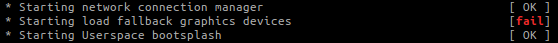

Using regular expressions, you can highlight anything you want in a text stream.

Color every _line_ containing the word "fail" in bold red, in the boot log:
`tail /var/log/boot.log | colout "^.*fail.*$" red bold`

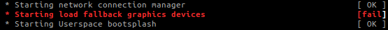

Color in blue the user name of the `ps` output that have been greped:
`ps aux | grep firefox | colout "^\w+\s" blue`

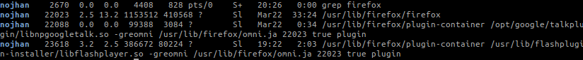

### Multiple colors

Using groups in the regular expressions, you can highlight several matchs in different colors.

Highlight the different parts of the permissions of files in your home directories, that are `rwx` for user and group,
but `r-x` for others:
`ls -l ~ | colout "^(d*)-*(rwx)(rwx)(r-x)" blue,red,yellow,green`

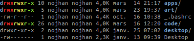

Using colormaps, you can change the colors for each lines, this is particularly useful for reading logs that have long
lines that are wrapped.
`tail /var/log/kern.log | colout "^.*$" rainbow`

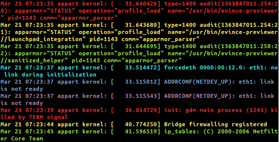

If you want more colors, you can highlight each line of your log with a random one among the 256 ANSI colors:
`tail /var/log/dmesg | colout "^.*$" Random`

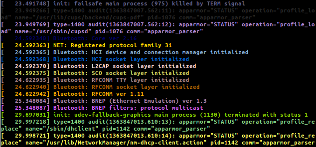

You can even fill your screen with esoteric disco characters (not _that_ useful, but fun):
`cat /dev/urandom | colout "." Random`

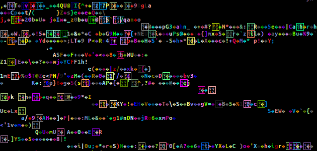

### Source code

You can use colout as a basic proxy to the pygments library, if you want to highlight a source code.

For example, let say you want to have a quick look at a source file, without being bothered by comments and empty lines:
`tail colout.py | grep -v "#" | grep -v "^\s*$" | colout -s Python monokai`

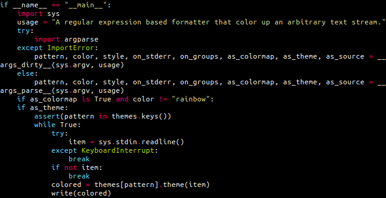

But even more interesting, you can highlight the syntax of the matching parts of your text stream, which is useful
for spotting code in a log.

For example, color the code parts in the output of `g++` (they come inside single quotes):
`make 2>&1 | colout "'.*'" Cpp vim`

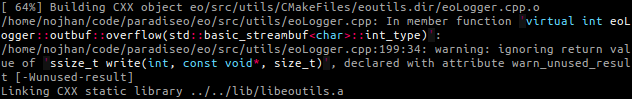

### Themes

colout comes with a set of handy shortcuts for coloring common outputs.

For example, if you often build your software with `cmake` but find its coloring scheme a bit boring, you can use the
following shortcut:
`make 2>&1 | colout -t cmake`

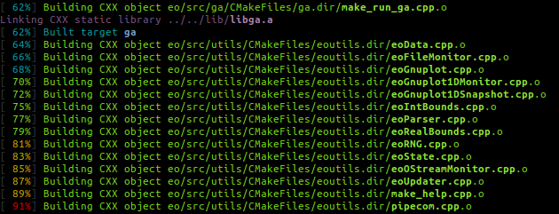

You can, of course, combine several calls to colout using pipes:
`make 2>&1 | colout -t cmake | colout -t g++`

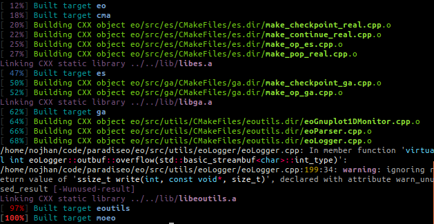

## Tips

To be able to use the syntax highlighting, you should install the `python-pygments` library.

`colout -h` will give you the lists of available colors, themes and programming languages.

Colormaps and source code syntax highlighting most often comes in 8 or 256 colors mode. Use a lower case first letter
for the 8 colors mode and an upper case first one for the 256 colors.

The 8 colors mode syntax highlighting only comes in two styles: light and dark. If you want more fancy styles, you
should use 256 colors mode, and thus upper case the first letter of the language name, or else the style is ignored.

You can leave simple words without quotes, but it is better to put the regexp in quotes to avoid escaping special
characters that would overwise be interpreted
by your shell (like parenthesis).

Do not hesitate to design your own theme, they are defined as separated files, and basically are just like chaining
several calls to colout in pipes, with the possibility to use python code around.

